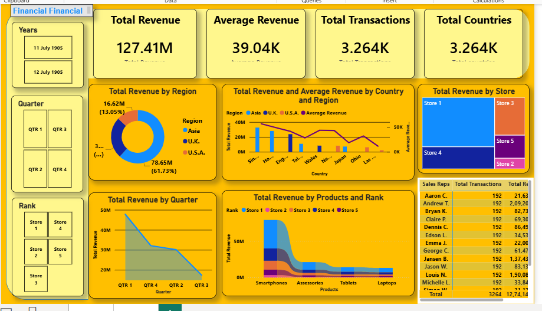

# Financial Analysis Dashboard (Interactive Dashboard using Power BI)

## Project Objective

The objective of this project is to analyze financial data from 2019–2020 and generate an interactive Revenue Analysis Report using Power BI.

## Dataset used
- <a href="https://github.com/Nandini101919/Financial-Analysis-Dashboard/blob/main/DataSet.xlsx"> Dataset </a>

## Business Questions (KPIs)

1. What is the total revenue generated during the period 2019–2020?
2. What is the average revenue generated across all transactions?
3. How many total transactions were recorded?
4. How many countries contributed to the overall revenue?
5. Which region generated the highest revenue?
6. Which country contributed the most to total revenue?
7. Which store rank achieved the highest revenue?
8. Which product category generated the highest revenue?
9. How did revenue perform across different quarters?
10. Which sales representative generated the highest revenue?

- DashBoard Interaction <a href="https://github.com/Nandini101919/Financial-Analysis-Dashboard/blob/main/DashBoard.png"> View DashBoard </a>

## Process

1. Collected and imported the financial dataset (2019–2020) into Power BI.
2. Performed data cleaning and transformation using Power Query.
3. Validated data quality and handled missing or inconsistent values.
4. Created DAX measures for Total Revenue, Average Revenue, Total Transactions, and Total Countries.
5. Built data relationships and optimized the data model.
6. Designed KPI cards to display key business metrics.
7. Created visualizations for revenue analysis by region, country, store, product, and quarter.
8. Added interactive slicers for Year, Quarter, and Store Rank filtering.
9. Applied formatting and dashboard design enhancements for better user experience.
10. Analyzed the results and generated actionable business insights.

## Dashboard

## Project Insights

- The dashboard provides a comprehensive view of financial performance during 2019–2020.
- Revenue distribution varies across regions, countries, products, and store ranks.
- Interactive filters help users analyze revenue trends across different quarters and years.
- KPI metrics such as Total Revenue, Average Revenue, Total Transactions, and Total Countries enable quick performance evaluation.
- Product and regional analysis help identify key revenue-generating areas and business opportunities.
- The dashboard supports data-driven decision-making through clear and interactive visualizations.

## Final Conclusion

This Financial Analysis Dashboard successfully transforms raw financial data from 2019–2020 into meaningful business insights using Power BI. By leveraging data modeling, DAX measures, and interactive visualizations, the dashboard enables effective analysis of revenue trends, transaction performance, regional contributions, and product performance. The project demonstrates how Power BI can be used to convert complex datasets into actionable insights that support strategic business decisions.
